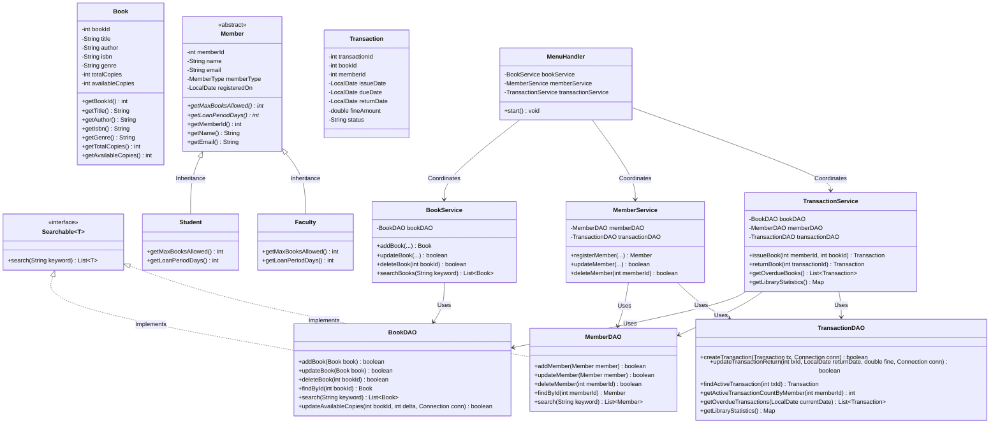

# Class Diagram & Object-Oriented Structure

This document details the class hierarchy, interfaces, attributes, and relationships in the **Smart Library Management System**.

---

## Mermaid Class Diagram

---

## Key OOP Concepts Visibly Demonstrated

1. **Abstraction**:
   `Member` is an abstract base class that defines the core properties of library patrons while leaving borrowing rules (`getMaxBooksAllowed()`, `getLoanPeriodDays()`) abstract for concrete realization.

2. **Inheritance**:
   `Student` and `Faculty` inherit all member state and methods from `Member`, establishing an *is-a* relationship.

3. **Polymorphism**:
   - `member.getMaxBooksAllowed()` resolves dynamically at runtime to `3` for Students and `5` for Faculty.
   - `member.getLoanPeriodDays()` dynamically resolves to `14` for Students and `30` for Faculty.
   - `MemberDAO` parses database rows and polymorphically constructs either `Student` or `Faculty` based on the database column `member_type`.

4. **Encapsulation**:
   All entity fields across `Book`, `Member`, and `Transaction` are declared `private` and accessed strictly via public getters, setters, and constructors.

5. **Interfaces**:
   The `Searchable<T>` generic interface defines a uniform search contract implemented by catalog and registry DAOs (`BookDAO`, `MemberDAO`).
