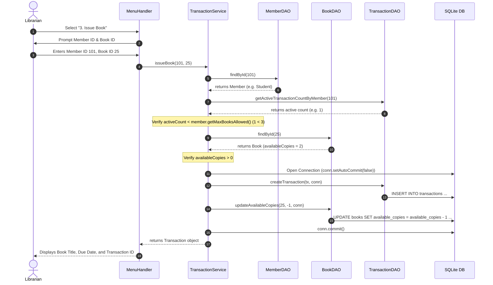
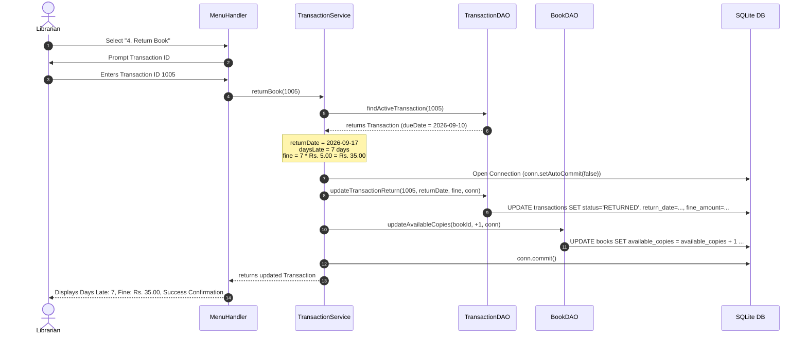

# Sequence Diagrams

This document illustrates the message-passing sequences between objects for key business flows: **Issue Book** and **Return Book with Fine Calculation**.

---

## 1. Issue Book Sequence

---

## 2. Return Book & Fine Calculation Sequence

